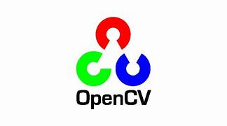
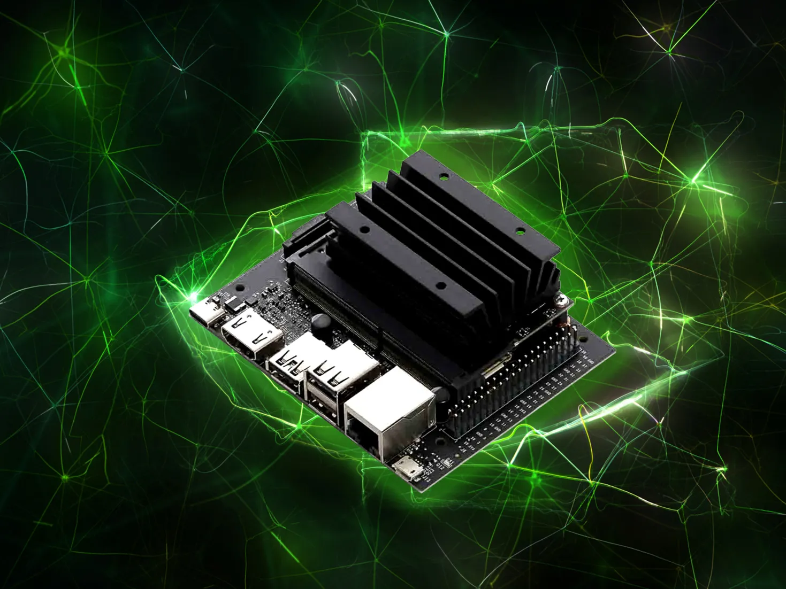

<h1 align="center">
  
  
</h1>
<h3 align="center">
Opencv DNN Support on windows, Linux and Jetson Nano 
==================================================== 
This repository contains the steps to build OpenCV with DNN support on Windows, Linux and Jetson nano.
</h3>
<h1 align="center">
     |
     |
    
</h1>

## Windows
Detailed instructions and setup for Windows. click [here](../windows/README.md) for more details.

## Linux
Detailed instructions and setup for Linux. click [here](linux/README.md) for more details.

## Jetson Nano
Detailed instructions and setup for Jetson Nano. click [here](../jetson-nano/README.md) for more details.

## Reference:
- Linux: 
    - https://learnopencv.com/opencv-dnn-with-gpu-support/
- Windows:
    - https://learnopencv.com/how-to-use-opencv-dnn-module-with-nvidia-gpu-on-windows/
    - https://machinelearningprojects.net/build-opencv-with-cuda-and-cudnn/
    - https://medium.com/analytics-vidhya/build-opencv-from-source-with-cuda-for-gpu-access-on-windows-5cd0ce2b9b37
- Jetson Nano:
    - To be updated soon.

