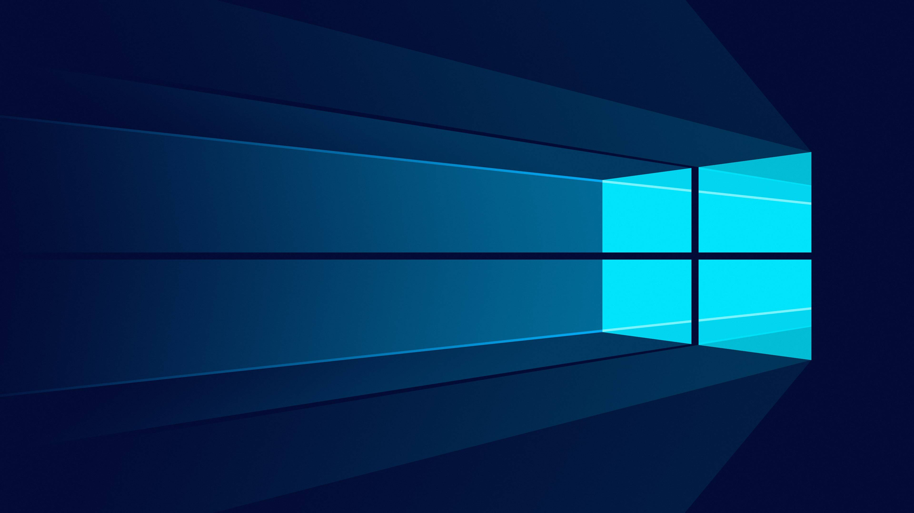

<h1 align="center">
  
  
</h1>
<h3 align="center">
Opencv DNN Support on windows, Linux and Jetson Nano 
==================================================== 
This repository contains the steps to build OpenCV with DNN support on Windows, Linux and Jetson nano.
</h3>

 |
 |

## Windows
Detailed instructions and setup for Windows.

## Linux
Detailed instructions and setup for Linux.

## Jetson Nano
Detailed instructions and setup for Jetson Nano.

