<h1 align="center">
Opencv DNN Support on windows</br>
=============================
</h1>
- This repository contains the steps to build OpenCV with DNN support on Windows.
- The steps are tested on Windows 11 with Visual Studio 2022.

# Steps
1. Install CMake
    - Download and install CMake from [here](https://cmake.org/download/) to build OpenCV with cuda and cudnn support.
    - Add CMake to the system path.
2. Install Visual Studio
    - Download and install Visual Studio 2019 from [here](https://visualstudio.microsoft.com/downloads/).
3. Install CUDA Toolkit
    - Download and install CUDA Toolkit from [here](https://developer.nvidia.com/cuda-toolkit-archive).
    - Add CUDA Toolkit to the system path.
4. Install cuDNN
    - Download and install cuDNN from [here](https://developer.nvidia.com/cudnn).
    - Add cuDNN to the system path.
5. Innstall anaconda
    Although this is not an important step, it’s recommended for smooth installation.
    You need to uninstall previous installations of Python and Anaconda.
    Reinstall Anaconda from here.
    - Download and install anaconda from [here](https://www.anaconda.com/download).
    Install NumPy from the terminal using pip install numpy.
6. clone opencv and opencv_contrib
    - clone opencv from [here](https://github.com/opencv/opencv.git)
    - clone opencv_contrib from [here](https://github.com/opencv/opencv_contrib.git)
    ```bash
    git clone https://github.com/opencv/opencv_contrib.git
    git clone https://github.com/opencv/opencv.git
    ```
7. Run Cmake GUI
    - In Where is the source code, Select the main opencv extracted folder.
    - In Where to build the binaries, Select the empty build folder we created above.</br>
     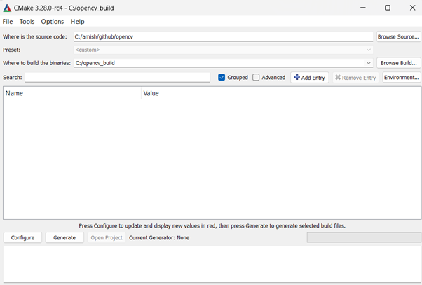
    - Click on Configure.
    - I have Visual Studio 2022 installed, so I selected Visual Studio 17 2022.
    - In the Optional platform for the generator, select x64.</br>
    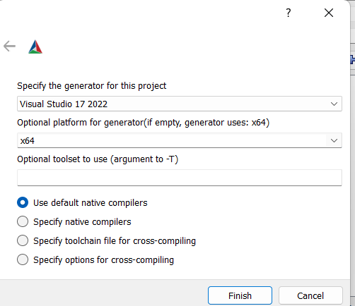
    - Click on Finish.
    - Once the configuration is done, you will see a lot of options.</br>
    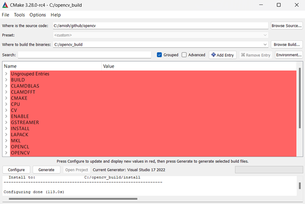
    - # Now search the following…
    - WITH_CUDA and tick/check it.</br>
    
    - OPENCV_DNN_CUDA and tick/check it.</br>
    
    - ENABLE_FAST_MATH and tick/check it.</br>
    
    - OPENCV_EXTRA_MODULES_PATH: and browse to the module folder in opencv-contrib we extracted in step 3.</br>
    
    - Click on Configure again.</br>
    
    - Once you see, Configuring done, check CUDA_FAST_MATH also.</br>
    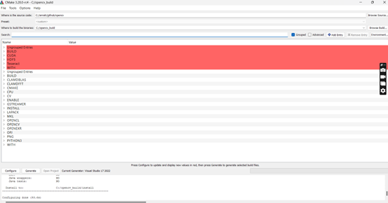
    - Now go to this [link](https://en.wikipedia.org/wiki/CUDA#:~:text=GPUs%20supported%5Bedit%5D) and check your compute capability against your graphic card.
      Mine is NvidiaRTX 4060, so my arch is 8.9</br>
    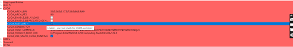
    - Delete all values except your Compute Capability.</br>
    
    - Again hit on the Configure button for the final time.
    - Once done, finally hit the Generate button.</br>
    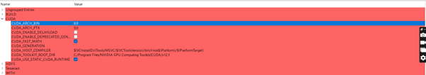
    - Now you will see a lot of files in your build folder.</br>
    
8. Build OpenCV with CUDA and cuDNN support
    - We will have a file like this OpenCV.sln.</br>
    
    - Now open the CMD Terminal in Administrator mode from the start menu.
    - Change the directory to your build folder using cd command and run OpenCV.sln.
    - It will open up Visual Studio.</br>
    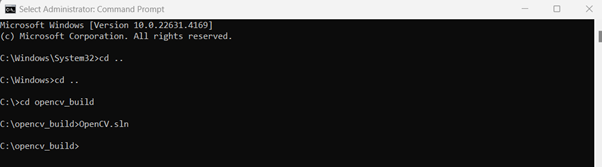
    - Once Visual Studio is opened, change Debug to Release.</br>
    </br>
    
    - Now right-click on the Solution OpenCV and click on Build Solution. 
    - It will take some time to build.</br>
    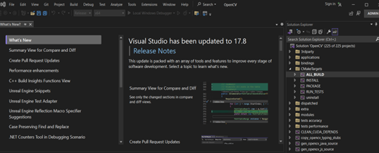
    - Once the build is done, you will see a message like this.</br>
    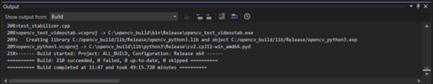
    - Now right click on INSTALL and build.</br>
    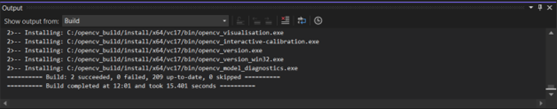
    - Close Visual Studio.
## Congratulations, you have successfully installed OpenCV with Cuda support.

9. Check OpenCV Installation.
    - Open Anaconda Prompt.
    - Run the following command.
    ```bash
    import cv2
    cv2.__version__
    cv2.cuda.getCudaEnabledDeviceCount()
    ```
    - If you see the version of OpenCV, you have successfully installed OpenCV with Cuda support.
    - If you see the number of Cuda devices, you have successfully installed OpenCV with Cuda support.</br>
    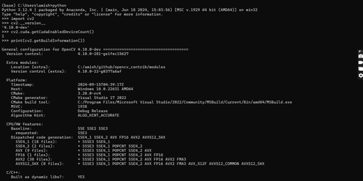

    - Validation of OpenCV with Cuda support and time comparision CPU vs GPU.
    ```bash
    import numpy as np
    import cv2 as cv
    import time

    npTmp = np.random.random((1024, 1024)).astype(np.float32)

    npMat1 = np.stack([npTmp,npTmp],axis=2)
    npMat2 = npMat1

    cuMat1 = cv.cuda_GpuMat()
    cuMat2 = cv.cuda_GpuMat()
    cuMat1.upload(npMat1)
    cuMat2.upload(npMat2)
    start_time = time.time()
    for i in range(1):
        cv.cuda.gemm(cuMat1, cuMat2,1,None,0,None,1)
    print("CUDA --- %s seconds ---" % (time.time() - start_time))
    start_time = time.time()
    for i in range(1):
        cv.gemm(npMat1,npMat2,1,None,0,None,1)
    print("CPU --- %s seconds ---" % (time.time() - start_time))
    ```
    - If you see the time difference between CPU and GPU, you have successfully installed OpenCV with Cuda support.</br>
    

9. Set Environment Variables
    - Add the following to the system path.
    ```bash
    C:\opencv\build\install\x64\vc16\bin
    C:\opencv\build\install\x64\vc16\lib
    C:\opencv\build\install\x64\vc16\bin\opencv_world452.dll
    C:\opencv\build\install\x64\vc16\bin\opencv_world452d.dll
    ```
# Reference:
- https://learnopencv.com/how-to-use-opencv-dnn-module-with-nvidia-gpu-on-windows/
- https://machinelearningprojects.net/build-opencv-with-cuda-and-cudnn/
- https://medium.com/analytics-vidhya/build-opencv-from-source-with-cuda-for-gpu-access-on-windows-5cd0ce2b9b37